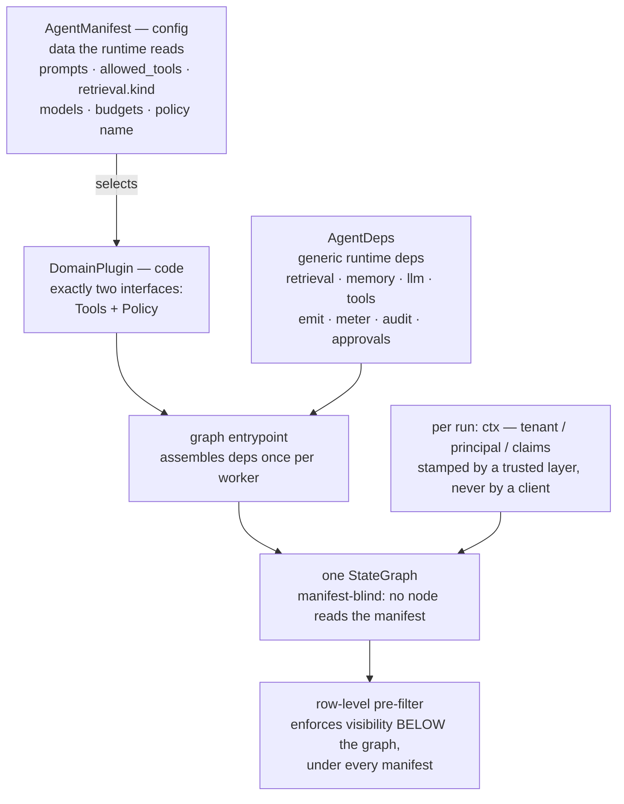
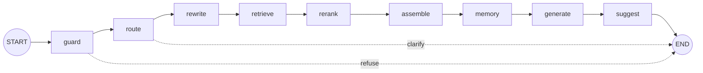

<div align="center">

# 🤖 intel-agent

### A portable, domain-adaptable AI agent runtime — standalone by default, embeddable by contract

**Ingest a corpus, ask a question, get a cited answer** — running by itself on one container,
or wired into a larger product through declared ports.

One LangGraph `StateGraph`, adapted to a new domain by swapping a **manifest** (config) plus a thin
**domain plugin** (code) — **never by forking the graph**.

[](#-technology--dependency-policy)
[](#-the-graph)
[](#-design-patterns-actually-in-use)
[](#-contracts-index)
[](#-security-model)
[](#-integrating-it-into-a-host)
[](#-how-this-repo-is-built)
[](#-license)

</div>

---

> ### ⚠️ Status: spec-first, and saying so on purpose
>
> Contracts, spec, plan, and task breakdown are **complete** and carry their original commit
> history. The port protocols and the exported conformance skeleton have landed. **The graph has
> not been implemented yet** — the gates below light up per stage as code arrives.
>
> | Gate | Today | Evidence |
> |---|---|---|
> | `make check-docs` | ✅ green | every relative link resolves; no reference-host vocabulary in normative prose |
> | `mypy --strict src` | ✅ green | ports are a published contract — an untyped one is a broken contract |
> | `make ci` | ❌ red | `ruff check .` reports one `RUF022` in `src/` plus findings in the vendored `.claude/skills/*/scripts` it sweeps in; `ruff format --check` wants two `src/` files. Tracked as **T003b** |
> | `make test` | ⏳ empty | `tests/` is scaffolding; Stage 2 lands the first suites |
> | conformance | ⏳ declared | every obligation is written and marked `xfail(strict)` — an accidentally-passing stub **fails** the build |
>
> A status line claiming green is how a standing failure stops being noticed, and a gate that is
> always red cannot tell you a *new* break from the old one. So the number is here, and it is the
> exit code that matters — not the tally.

Extracted from [aisat-intel](https://github.com/truongpx396/aisat-intel) at `369756e`, which remains
the reference **embedding host**.

---

## 📖 Table of contents

- 🎯 [What this is](#-what-this-is)
- 🏆 [Why it reads as production-grade](#-why-it-reads-as-production-grade)
- 🧬 [Design patterns actually in use](#-design-patterns-actually-in-use)
- 💡 [The idea in one screen](#-the-idea-in-one-screen)
- 🔋 [Batteries included, batteries replaceable](#-batteries-included-batteries-replaceable)
- 🧩 [The graph](#-the-graph)
- 🧰 [Tools](#-tools)
- 🔐 [Security model](#-security-model)
- 📦 [Three profiles, one binary](#-three-profiles-one-binary)
- 🚀 [Quickstart](#-quickstart)
- 🔌 [Integrating it into a host](#-integrating-it-into-a-host)
- 📡 [Developing each side without the other](#-developing-each-side-without-the-other)
- 💬 [Chat platforms](#-chat-platforms)
- 🧱 [Technology & dependency policy](#-technology--dependency-policy)
- 📂 [Repo layout](#-repo-layout)
- 📚 [Contracts index](#-contracts-index)
- 🧪 [Quality gates](#-quality-gates)
- 🧭 [How this repo is built](#-how-this-repo-is-built)
- 🚧 [Roadmap](#-roadmap)
- 🤝 [Relationship to aisat-intel](#-relationship-to-aisat-intel)
- 📄 [License](#-license)

---

## 🎯 What this is

A retrieval agent you can run **as a product** — it ingests files, URLs, and text, answers questions
with inline citations, streams tokens, pauses for a human before it does anything irreversible, and
keeps its own ledger of what it spent.

It is also a **library with a declared boundary**. A host that already has auth, billing, a corpus
pipeline, and a front end installs the package, implements the ports, runs the shipped conformance
suites, and gets the same graph — byte-identical — under its own infrastructure.

Those are not two codebases and not two modes. They are the same binary with different bindings, and
the rule that keeps them honest is one sentence:

> **A default is never privileged code.** It is one implementation of a declared port, held to the
> same conformance suite an override must pass.

That is what stops "standalone" from quietly becoming "monolith with seams painted on".

**Not a multi-tenant SaaS.** The identity and metering defaults are deliberately minimal. A
deployment needing real billing or org management embeds the runtime in a host that provides them.

---

## 🏆 Why it reads as production-grade

Every row below is a constraint the design is *built around*, paired with the mechanism that
enforces it and the artifact you can go read. None of them is a promise in prose.

| Production constraint | Mechanism | Where it lives |
|---|---|---|
| **Access control is not a prompt concern** | The visibility predicate is pushed **into the store** as a pre-filter. Post-filtering in Python is a correctness bug *even when the output is identical* — it means the store returned rows the caller may not see | [`RetrievalService`](src/intel_agent/ports/__init__.py), `AccessFloorContract` |
| **The floor does not vary by deployment** | The access-correctness suite passes **unchanged** across the two-store, single-store, and single-file profiles — from one body, with no profile branches. *If it ever needs a branch, the boundary is wrong, not the test* | [`AccessFloorContract`](src/intel_agent/conformance/__init__.py) |
| **Config can narrow, never widen** | A manifest may *name* a policy; it may never *be* one. A broader manifest surfaces zero additional rows | [agent-runtime.md](specs/001-agent-runtime/contracts/agent-runtime.md) |
| **Every run ends under a named boundary** | Completion, refusal, clarification, deadline, cost ceiling, step cap, no-progress, context window, or explicit failure. No run ends by exhausting something the vocabulary cannot name | [agent-graph.md](specs/001-agent-runtime/contracts/agent-graph.md) |
| **Degradation is never silent** | A reranker outage degrades to fusion order; a memory outage degrades to no injected memory. Neither fails the run — and `outcome` becomes `degraded`, never `ok` | [stream-events.md](specs/001-agent-runtime/contracts/stream-events.md) |
| **Runs are bounded in money, not just time** | A deadline bounds spend only *incidentally* — what a run can buy in 120 seconds is a property of provider throughput on the day. A per-run cost ceiling is evaluated at the same node boundaries | [agent-graph.md](specs/001-agent-runtime/contracts/agent-graph.md) |
| **A step cap is not a loop detector** | A cap bounds *repetition* without detecting it. A run repeating one action ends as `no_progress` **before** its cap fires, rather than paying the amplified rate sixty times and settling like a run that worked | [agent-graph.md](specs/001-agent-runtime/contracts/agent-graph.md) |
| **Redelivery cannot double-charge** | The runtime cannot promise exactly-once emission, so it says so: every spend carries an `idem_key` and the host **must** reject duplicates by it | [`Meter`](src/intel_agent/ports/__init__.py), `MeterContract` |
| **Irreversible actions need a human** | Mutating and outward tool calls are refused unless human-gated and in the durable form — with an *undeclared* capability treated as outward. A pending or rejected gate spends **zero** and mutates nothing | [approval-ports.md](specs/001-agent-runtime/contracts/approval-ports.md) |
| **Untrusted text is data, never instructions** | Everything the runtime did not screen *this turn* is delimited: retrieved chunks, attachments, web results, image bytes, the history digest, and **recalled memories** | [agent-graph.md](specs/001-agent-runtime/contracts/agent-graph.md) |
| **A paused run outlives a deploy** | The checkpoint records the build and state-schema version that wrote it. A resume under a differing schema fails as `checkpoint_incompatible`; a differing build SHA alone is recorded and resumes — otherwise every ordinary deploy would kill every in-flight run | [agent-graph.md](specs/001-agent-runtime/contracts/agent-graph.md) |
| **Contract drift fails a build, not a review** | The conformance suites ship **inside the wheel**, so a host imports and runs the same classes against its own implementations | [`intel_agent.conformance`](src/intel_agent/conformance/__init__.py) |
| **Claims are asserted negatively too** | A smoke test passes just as green with a stray client quietly bound, so the *absence* is checked mechanically: no forbidden client installed, no forbidden service in the topology, no forbidden config present | [assert-profile-b-isolation.sh](scripts/assert-profile-b-isolation.sh) |
| **The runtime holds no provider key** | It names gateway aliases (`fast` / `smart` / `embed` / `rerank`), never concrete model IDs. A model swap is a gateway config change, invisible here | [compose.profile-b.yml](deploy/compose.profile-b.yml) |
| **Docs cannot rot quietly** | Two CI gates: every relative link must resolve, and reference-host vocabulary may not leak into normative prose. The contracts were moved by `git filter-repo` carrying links written against the old tree — a link that silently 404s is how an extracted spec rots into fiction | [check-links.sh](scripts/check-links.sh), [check-vocabulary.sh](scripts/check-vocabulary.sh) |
| **Reusability is proven, not asserted** | The claim is backed by a second, unrelated domain plugin running the **unmodified** graph green end-to-end | [spec.md](specs/001-agent-runtime/spec.md) |

---

## 🧬 Design patterns actually in use

| Pattern | How it shows up here |
|---|---|
| **Ports & Adapters (Hexagonal)** | [`ports/`](src/intel_agent/ports/__init__.py) holds `Protocol`s and imports **nothing concrete** — no store client, no bus client, no provider SDK, no driver. A static import scan enforces it, because a single concrete import there would make every downstream module transitively depend on a backend |
| **Composition root + DI** | `AgentDeps` is assembled **once per worker** and passed through `config['configurable']`. Nodes are pure `(state, config)` functions and never import a client at module scope |
| **Strategy selected by configuration** | `retrieval.kind`, `bus.kind`, `memory.kind`, `policy` — the manifest *selects* an implementation by name and never contains one |
| **Consumer-driven contract testing** | Port conformance suites are **public API**, versioned as such, shipped in the package, and run by host repos in their own CI |
| **Test doubles as a shipped artifact** | `FakeAgentRuntime` + golden JSONL fixtures live **here**, so they cannot become a second, unversioned definition of the event vocabulary |
| **Fail-closed authorization** | Unknown action ⇒ denied. Unrecognized identity ⇒ refused, never given a default. Absent required port ⇒ loud failure; absent optional port ⇒ *observable* degradation |
| **Predicate pushdown** | Visibility is enforced below the graph, inside the query — not filtered after the fact |
| **Bulkheads per node** | Every node carries its own retry, timeout, and degrade policy, so one dependency's outage is contained to one node's contribution |
| **Human-in-the-loop interrupt/resume** | The canonical LangGraph `interrupt()` / `Command(resume=…)` pattern, settling **zero spend** while paused |
| **Idempotency keys** | On every spend emission, because redelivery is normal and pretending otherwise is how a ledger double-charges |
| **Capabilities as declared data** | Chat platforms declare what they can do; the runtime adapts. Not a subclass hierarchy — see [why below](#-chat-platforms) |
| **Versioned vocabularies** | The stream-event taxonomy is versioned; so is the checkpoint state schema, which is what makes a cross-version resume a named failure rather than a silent one |
| **Stability tiers on published ports** | `Stable` / `Beta` / `Experimental`, promoted and never demoted — a tier states how much a shape has been *argued with*, not how much care went into it |
| **Governance as a checked-in artifact** | A [constitution](.specify/memory/constitution.md) whose shared principles are byte-identical with the reference host; a local-only edit to a shared principle is a defect |

---

## 💡 The idea in one screen



- **Everything the runtime reads is config.** The only per-domain **code** is (1) the tool bodies
  and (2) the authorization `Policy`.
- **Config selects, code enforces.** A manifest may *name* a policy; it may never *be* one. A
  manifest can narrow what an agent may do — never widen what a principal may see.
- **The graph is manifest-blind.** No node reads the manifest. Adding a domain changes deps and
  config, never a node.

An agent, in full, is one manifest row:

```yaml
id:            <agent-id>
tenant:        <opaque-tenant-key>          # opaque; the runtime never interprets it
agent_role:    user                         # the label allowed_tools is keyed on
prompts:       { system: prompts/response_format, rewrite: prompts/query_rewrite }
allowed_tools: [search_workspace_knowledge, search_personal_knowledge, get_document_by_id]
models:        { fast: <alias>, smart: <alias> }        # gateway aliases only — never model IDs
retrieval:     { kind: pgvector }                       # binds a RetrievalService
memory:        { kind: mem0, retention_days: 180 }      # or { kind: none } — degrades cleanly
bus:           { kind: inprocess }                      # redis_streams | jetstream
budgets:       { run_credits_cap: <int>, max_loop_depth: 20, max_no_progress_steps: 3,
                 history_token_budget: 24000 }
policy:        <policy-name>                # ← SELECTS a Policy impl; is NOT the policy
can_write:     false
```

**Self-contained ≠ single-instance.** The runtime is a stateless worker: the manifest is loaded per
run, graph state lives in the checkpointer, and scaling is nothing but more queue-group replicas of
the same image. There is no per-domain deploy pipeline and no per-domain fork of the graph.

---

## 🔋 Batteries included, batteries replaceable

| Capability | Standalone (ships here) | Embedded (host overrides) |
|---|---|---|
| Corpus | built-in `Ingestor` — files, URLs, text | the host's pipeline |
| Identity | built-in `IdentityBinder` — single-user or user list | the host's auth |
| Interface | built-in chat UI + CLI | the host's front end |
| Metering | a **real local ledger** — tokens, cost, per principal, idempotent | the host's ledger |
| Store | SQLite (Profile C) or Postgres (Profile B) | whatever the host runs |

There is deliberately **no no-op meter**: a meter that counts nothing makes an unmetered deployment
look configured. When a host binds its own, the runtime demotes itself to an emitter and the host
ledger becomes authoritative — a binding choice, never a silent one.

---

## 🧩 The graph

One `StateGraph`, compiled two ways — an ephemeral interactive pass and a checkpointed durable one —
**never two graphs**. Phase-1 edge order for an interactive (`semantic`) run:



| Node | Does |
|---|---|
| `guard` | Moderation + injection screen + per-role tool allowlist. Fail-closed — blocks before any retrieval or spend. |
| `route` | Classifies intent (`semantic` / `structured` / `long_horizon`) and a model-tier alias. Runs once per run; immutable after. |
| `rewrite` | History-aware query rewrite/expansion. |
| `retrieve` | Vector/hybrid search on `semantic`; a fixed parameterized tool on `structured` — never free-form Text-to-SQL. |
| `rerank` | Cross-encoder rerank over the merged candidate set. |
| `assemble` | Parent-chunk expansion, dedupe, token-budget trim. |
| `memory` | Per-user memory injection, clearance-filtered at read time. Never fails the run. |
| `generate` | Grounded generation with inline citations; streams tokens. |
| `suggest` | Follow-up suggestions. Never fails the run. |

The durable form adds a tenth node, `human_gate` — the canonical LangGraph `interrupt()` /
`Command(resume=…)` pattern, pausing a run before an index-mutating or outward-reaching step and
settling **zero spend** while paused. Every node is a pure `(state, config)` function with its own
retry/timeout/degrade policy, so a reranker outage degrades to fusion order and a memory outage
degrades to no injected memory — neither fails the run.

Because that gate pauses **indefinitely**, a paused run outlives deploys: its checkpoint records the
build and state-schema version that wrote it, and a resume under a differing schema fails as
`checkpoint_incompatible` rather than continuing into a topology the checkpoint predates. A differing
build SHA alone is recorded and resumes — otherwise every ordinary deploy would kill every in-flight
run.

### Everything reaching the prompt is bounded

`context` by a token trim, tool results by a declared `max_result_bytes`, and the conversation itself
by a **context budget** — opening and recent turns verbatim, the middle folded into one cumulative
summary, compacted once at the entrypoint so every node sees the same history. A run that breaches
its wall-clock deadline *after* the context is assembled degrades to an answer under the remaining
budget rather than discarding four settled model calls; one that breaches before it fails cleanly.
Nothing degrades silently — `outcome` is `degraded`, never `ok`.

Runs are bounded in **money** as well as time, on the interactive path too: a deadline bounds latency
and bounds spend only incidentally, since how much a run can buy in 120 seconds is a property of
provider throughput on the day. A step count is no substitute either — the same step costs
differently on `fast` and on `smart`. So every run carries a cost ceiling evaluated at the same node
boundaries, degrading past `assemble` exactly as a deadline does. And because a step cap bounds
*repetition* without detecting it, a long-horizon run that keeps repeating one action ends as
`no_progress` before its cap fires, rather than paying the amplified call rate sixty times and
settling like a run that was working.

### The one input that is easiest to get wrong

Everything reaching the prompt that the runtime did not screen **this turn** is delimited as data,
never instructions: retrieved chunks, attachments, web results, image bytes, the history digest, and
**recalled memories**. Memory is the one that matters most and is easiest to miss — it is the only
input that is both persistent and cross-session, so a sentence that entered on turn 1 is replayed on
every later turn without `guard` seeing it again. Clearance re-filtering answers *may you see this*;
it does not answer *is this an instruction*, and both are required. "Replayed until something deletes
it" is the third obligation: `MemoryService` carries a scoped, audited `delete` and a retention
horizon enforced **at recall**, because a runtime that can identify a poisoned memory and not remove
it has diagnosed the problem and stopped.

📄 Full node-by-node contract, the `AgentState` schema, the reliability table, run-level budgets, and
the Phase-2 seams (corrective retrieval, faithfulness checking, complexity-based model routing):
**[contracts/agent-graph.md](specs/001-agent-runtime/contracts/agent-graph.md)**.

---

## 🧰 Tools

Scoped tools across four categories — **one set of implementations, exposed two ways**: in-process to
the built-in graph, and over MCP (`:8002`) to external agents, through the **same** policy wrapper
(allowlist check, tenant/principal scoping, audit log).

| Category | Tools | Notes |
|---|---|---|
| **A — Knowledge** (Tier 1) | `search_personal_knowledge`, `search_workspace_knowledge`, `get_document_by_id`, `list_documents` | Read-only, clearance/ownership pre-filtered *before* scoring |
| **B — Structured** (Tier 2) | `query_employees`, `query_projects`, `query_metrics` | Typed arguments only — hand-written scoped queries, never generated SQL |
| **C — Utility** | `get_current_datetime`, the shared `web_distill` fetch | `web_distill` is SSRF-guarded: `https`-only, DNS-rebinding-safe, no redirects |
| **D — Agent actions** | `web_search`, `edit_note` | Human-gated per call, access-bounded to `min(agent, owner)` clearance, durable-form only |

A tool not in the caller's `allowed_tools` is rejected **before execution** — the defense against a
compromised or injected run escalating its own privileges. Every tool also declares a **capability**
(`read_only` / `mutating` / `outward`), and the wrapper refuses a mutating or outward call that is
not human-gated and not in the durable form — with an *undeclared* capability treated as outward.

That rule earns its keep on the `mcp_client` path, where a manifest can mount a **remote** catalog
this repo never wrote: the remote server owns authorization over its own rows, but whether a human
approved an irreversible action is *this runtime's* obligation, and a config-only change must not be
able to remove it. The budget behind the rule — at most two of {private data, untrusted content,
outward reach} in one unsupervised run — is in
[research.md](specs/001-agent-runtime/research.md).

Every tool declares a result cap and a clipped result is **marked truncated**, never silently
shortened. Every result is scrubbed of credential-shaped values — including the deployment's own
bound secrets — before it reaches a prompt, the debug panel, or the audit log, because tool output
never passes the model-call path where PII scrubbing happens.

📄 Full catalog, arguments, and enforcement rules:
**[contracts/mcp-tools.md](specs/001-agent-runtime/contracts/mcp-tools.md)**.

---

## 🔐 Security model

**The floor is below the graph.** Not in the prompt, not in a tool wrapper, not in a middleware —
inside the store, as a pre-filter on the query itself. Everything above it is defense in depth.

| Layer | Obligation |
|---|---|
| `ctx` provenance | Stamped by a **trusted layer** — never by a client, never derived from model, tool, or document output. A `ctx` a caller can influence is a privilege-escalation primitive, not a parameter |
| Store predicate | Applied **inside** the store. Post-filtering in Python produces an identical response and is still a breach |
| `Policy` purity | No I/O, no clock, no randomness — purity is what makes a policy exhaustively testable and what stops it failing *open* on a network blip |
| Tool allowlist | Checked before execution, in the shared wrapper — so the in-process and remote transports are indistinguishable in both result and audit trail |
| Capability gate | `mutating` / `outward` require a human decision, in the durable form; undeclared ⇒ treated as outward |
| Memory recall | Re-filtered against **current** clearance on every recall. Filtering only at write time means a demotion never takes effect — which converts a clearance change into a permanent leak |
| Audit | **Exactly one** entry per tool call, including on failure. Zero rows on the failure path is how an attacker's probe becomes invisible |
| Ingestion | Content whose ownership cannot be established is **rejected**, never stored unowned. Parsing a document must never execute it |
| Secrets | The runtime holds no provider key. The gateway container is the only key holder |

Release blockers, not backlog items: **100% access-control correctness**; the access suite passing
**unchanged** across profiles; injection refused **before** any retrieval or spend; zero spend on
refused, paused, or rejected runs.

---

## 📦 Three profiles, one binary

|  | **A** — reference host | **B** — self-contained | **C** — minimal |
|---|---|---|---|
| Composition | embedded in a full product | one container | one container, one file |
| Runtimes | host kernel + this Python tier | this Python container alone | this Python container alone |
| Retrieval | vector store + RLS | Postgres + pgvector | SQLite — dense + FTS5 + fusion |
| Access floor | RLS **+** vector pre-filter | RLS alone | **the query, not the engine** |
| Bus | JetStream | in-process | in-process |
| Checkpointer | Redis / Postgres | Redis | SQLite (same file) |
| Metering | host's ledger | default local ledger | default local ledger, same file |
| Auth / billing | host kernel | re-satisfied in-container | single-user or explicit user list |

A is B **plus** the host kernel and the heavier backing services — a **superset relation, not a
fork**. C is B **minus** every external service, at the cost of a weaker floor **it is required to
announce**: binding SQLite emits a startup warning naming the reduction and fails closed on a
multi-tenant manifest.

All three run the same binary and the same manifest schema, and the access-correctness suite passes
unchanged across all three. Swapping a backing service is a port implementation or a config value —
never a source change to the graph.

---

## 🚀 Quickstart

```bash
make up      # postgres+pgvector, redis, llm gateway  — the self-contained profile
make smoke   # a cited answer, with NO vector DB and NO message broker bound
make ci      # lint, typecheck, unit, conformance, link check
make dev     # streaming CLI REPL
```

```bash
make smoke-assert-isolation   # the NEGATIVE half of the claim
```

That second command asserts what a passing smoke test cannot: that no forbidden client is installed,
no forbidden service is in the topology, and no forbidden config is present. A smoke test passes just
as green with a stray client quietly bound; that is the half that rots silently, so it is checked
mechanically.

The same discipline shows up in [deploy/compose.profile-b.yml](deploy/compose.profile-b.yml), where
the absent services are **absent rather than commented out** — a commented-out service is one
uncomment away from quietly invalidating the standalone claim.

`make help` lists every target.

---

## 🔌 Integrating it into a host

A host installs the package, implements the ports, and passes the conformance suites:

```toml
# host pyproject.toml
dependencies = ["intel-agent @ git+https://github.com/truongpx396/intel-agent@v0.1.0"]
```

```python
# host tests — contract drift fails a build, not a review
from intel_agent.conformance import RetrievalServiceContract, PolicyContract

class TestHostRetrieval(RetrievalServiceContract):
    impl = MyRetrievalService
```

`intel_agent.conformance` is **public API** and is versioned as such — which is exactly why it ships
inside the package rather than under `tests/`. Putting it in `tests/` would leave it out of the wheel
and make the cross-repo drift check unshippable, reducing *"we prove reuse"* back to *"we assert
reuse"*.

A change to a port protocol or to
[`host-integration.md`](specs/001-agent-runtime/contracts/host-integration.md) lands **before** the
host PR that consumes it — never in the same merge window.

**Ports carry a stability tier**, because not all of them have the same evidence behind them. The
read path is `Stable` (breaking change ⇒ major bump); `Ingestor`, `Bus`, and `MemoryService` are
`Beta`; `Channel` and `IdentityBinder` are `Experimental` — designed against three platform specs and
built against none. A tier states how much a shape has been argued with, not how much care went into
it, and it is promoted, never demoted. `SecurityCtx` and the host contract are `Stable` regardless:
they are the security boundary, not a port.

**What does not travel with the runtime** — and must be re-satisfied by the host: credit metering,
the row-level-security session plumbing, and the moderation provider behind `guard`. The runtime
declares *that* these run; it never implements *how* a host bills or authenticates.

---

## 📡 Developing each side without the other

Splitting a runtime out of its host creates a testing hole in both directions, and one mechanism
closes both: a **versioned event vocabulary** plus **doubles the runtime ships**
([contracts/stream-events.md](specs/001-agent-runtime/contracts/stream-events.md)).

**A host has a UI and a transport but no agent** — so it imports one:

```python
from intel_agent.testing import FakeAgentRuntime, scenarios

graph = FakeAgentRuntime(scenarios.GATE_PAUSE_RESUME)   # no model, no store, no network
```

Scenarios cover a cited answer, a refusal, a clarification, a human gate pausing and resuming, a
degraded rerank, a deadline deferral, and an error. The double ships **here**, not in the host, so it
cannot become a second unversioned definition of the vocabulary — and golden JSONL fixtures let both
repos assert against the *same files*.

The published event vocabulary is small and total: `run_started`, `node_started`, `token`,
`tool_use`, `tool_result`, `citations`, `debug_fragment`, `suggestions`, `clarification`,
`gate_opened`, `gate_resolved`, `degraded`, `error`, `run_finished` — each with a declared writer,
payload, and ordering rule.

**This repo has an agent but no UI** — so it has two dev harnesses, both dev-only and never packaged:

| | For |
|---|---|
| `make dev` | streaming CLI REPL — the default loop: fast, scriptable, diffable, CI-friendly |
| `make dev-ui` | one self-contained SSE page — token streaming, the debug panel, a real approve/reject gate |

The page is a **reference consumer, not a product**: it renders only from the published vocabulary
and calls no bespoke endpoint. If it ever needs a special case, the vocabulary is missing something —
fix the vocabulary, not the page. It must never grow auth, persistence, or styling ambitions; a dev
harness that becomes a second product surface re-creates the coupling this extraction removed.

---

## 💬 Chat platforms

Discord, Slack, and WeChat reach the runtime through the `Channel` port. The split:

| We own | You own |
|---|---|
| Protocol plumbing — connection, events, rate limits, chunking, streaming style | `IdentityBinder`: platform user → `(tenant, principal, claims)` |

Identity mapping stays yours because it *is* a host obligation, and a wrong answer there is a
privilege escalation. An unrecognized user is **refused**, never given a default identity — on a
public Discord guild, unrecognized is the normal case, and a default identity there hands the corpus
to whoever finds the bot.

Capabilities are **declared data**, not subclasses, because the platforms genuinely differ:

| | Discord | Slack | WeChat |
|---|---|---|---|
| Streaming | via message edit | via `chat.update` | **none** |
| Reply deadline | — | — | **~5 s** |
| Max message | 2,000 chars | ~3,000 | 2,048 bytes |

WeChat is why the model is data: an adapter layer built around Discord and later "extended" to WeChat
works in testing and fails on any query slower than five seconds. The runtime buffers for
non-streaming channels and **defers** rather than truncating when a deadline is hit — a truncated
answer presented as complete is the failure mode worth designing against.

A capability declaration that *lies* is worse than one that is conservative, so `ChannelContract`
checks honesty directly: `supports_streaming: true` must emit more than one progressive update.

Adapters install as extras — `intel-agent[discord]`, `intel-agent[slack,wechat]`. A platform SDK is
never a base dependency, and the contract asserts the absence.
See [contracts/channels.md](specs/001-agent-runtime/contracts/channels.md).

---

## 🧱 Technology & dependency policy

**Python 3.12, single runtime** — deliberately. Adding a second requires a constitutional amendment.

| Layer | Choice |
|---|---|
| Graph & checkpointing | LangGraph (`BaseCheckpointSaver`: Redis, Postgres, or SQLite) |
| Schemas | Pydantic v2 |
| Model access | the `openai` client, pointed at **any** OpenAI-wire gateway |
| Logging / retries | structlog, tenacity |
| Lint / types / tests | ruff, mypy `--strict`, pytest (unit · integration via testcontainers · conformance · smoke) |
| Packaging | `uv` + hatchling, lockfile committed, CI installs `--frozen` |

The dependency policy is the architecture, restated in `pyproject.toml`:

> **Runtime deps are the generic runtime only.** Anything a host supplies through a port — a vector
> store client, a bus client, a provider SDK — belongs in an extra, never in the base. A
> self-contained install must not be able to import a vector DB or a message broker.

Extras compose into the shapes you actually deploy: `intel-agent[profile-a]`,
`[profile-b]`, `[profile-c]`, `[standalone]`, `[channels]`. Note that the SQLite extra is
**deliberately empty** — it needs no dependency at all, and exists so that
`intel-agent[sqlite]` is a real, discoverable choice rather than an undocumented default.

---

## 📂 Repo layout

```
specs/001-agent-runtime/
├── spec.md  plan.md  research.md  data-model.md  tasks.md  quickstart.md
├── contracts/
│   ├── agent-deps.md         # the AgentDeps port bundle   ← the boundary
│   ├── host-integration.md   # what a host MUST provide    ← the boundary
│   ├── agent-graph.md        # state, nodes, checkpointing, streaming, budgets
│   ├── agent-runtime.md      # manifest + plugin, profiles, swap matrix
│   ├── mcp-tools.md          # the tool catalog + allowlist dispatch
│   ├── approval-ports.md     # human-in-the-loop gate
│   ├── stream-events.md      # the event vocabulary + shipped test doubles
│   └── channels.md           # Discord / Slack / WeChat
└── diagrams/                 # excalidraw sources
src/intel_agent/              # graph/ tools/ retrieval/ memory/ ports/ channels/ conformance/
scripts/                      # the mechanical gates: links, vocabulary, profile isolation
deploy/                       # compose topologies + gateway config
prompts/  evals/  migrations/  tests/
```

---

## 📚 Contracts index

Every boundary this runtime has, declared **before** implementation.

**Read these two first:**

| Contract | What it settles |
|---|---|
| [agent-deps.md](specs/001-agent-runtime/contracts/agent-deps.md) | **The port surface.** The complete list of what the runtime needs from outside. Nothing else may be reached for |
| [host-integration.md](specs/001-agent-runtime/contracts/host-integration.md) | **The host's obligations.** Stamp `ctx`, enforce the access floor, meter, moderate, gate |

**The runtime:**

| Contract | What it settles |
|---|---|
| [agent-graph.md](specs/001-agent-runtime/contracts/agent-graph.md) | State schema, node identity, checkpointing, streaming, run budgets, reliability policy |
| [agent-runtime.md](specs/001-agent-runtime/contracts/agent-runtime.md) | `AgentManifest` + `DomainPlugin` composition, the backing-service swap matrix, the profiles |
| [mcp-tools.md](specs/001-agent-runtime/contracts/mcp-tools.md) | The tool catalog, allowlist dispatch, the human-gated action tools |
| [approval-ports.md](specs/001-agent-runtime/contracts/approval-ports.md) | `HumanGate` / `ApprovalStore` — the human-in-the-loop gate |
| [stream-events.md](specs/001-agent-runtime/contracts/stream-events.md) | The event vocabulary, `FakeAgentRuntime`, and the golden fixtures that let each repo be built without the other |
| [channels.md](specs/001-agent-runtime/contracts/channels.md) | The `Channel` capability model and the `IdentityBinder` split |

Supporting artifacts: [spec.md](specs/001-agent-runtime/spec.md) ·
[plan.md](specs/001-agent-runtime/plan.md) ·
[research.md](specs/001-agent-runtime/research.md) ·
[data-model.md](specs/001-agent-runtime/data-model.md) ·
[tasks.md](specs/001-agent-runtime/tasks.md) ·
[quickstart.md](specs/001-agent-runtime/quickstart.md) ·
[contracts/README.md](specs/001-agent-runtime/contracts/README.md)

---

## 🧪 Quality gates

CI ([.github/workflows/ci.yml](.github/workflows/ci.yml)) runs the gate order the constitution fixes:

```
lint/format → unit → integration → contract → conformance → profile smoke → build → security scan
```

Jobs are **presence- and change-guarded**, so the pipeline is inert while the repo is specs-only and
lights up as code lands. Notable jobs:

| Job | Why it exists |
|---|---|
| `secret-scan` | Gitleaks on every change, always — cheap, and credential leaks do not respect path filters |
| `docs` | Relative-link + vocabulary integrity. The contracts were moved by `git filter-repo` carrying ~40 links written against the old tree |
| `python` | ruff, mypy, pytest with coverage, `pip-audit` |
| `conformance` | The suites this repo **exports**. A host runs the same classes against its own implementations — that is what makes cross-repo drift a build failure instead of a review catch |
| `profile-b-smoke` | The repo's reason to exist: a cited answer with no vector DB, no broker, no host kernel — then the isolation assertion |
| `docker-lint` | Hadolint on every Dockerfile |

Local equivalent: `make ci`. Dependencies install `--frozen` from a committed lockfile, so CI and
your machine resolve the same tree.

---

## 🧭 How this repo is built

Spec-driven, with the process itself checked in:

- **A constitution** ([.specify/memory/constitution.md](.specify/memory/constitution.md)) with
  numbered, versioned principles and a sync-impact report on every amendment. Plans carry a
  **Constitution Check** table citing the artifact that satisfies each principle — and four rows of
  that table were re-audited and found to be *wrong*, each restating the principle's topic instead of
  naming evidence. They are fixed and the finding is recorded, because a check that passes every
  time is worth nothing.
- **Contracts before code.** Every port has a written contract and a conformance suite scheduled
  *before* the backend it constrains — a suite written after an implementation documents it; one
  written before it constrains it.
- **TDD is a scheduling property, not an intention.** In [tasks.md](specs/001-agent-runtime/tasks.md),
  every implementation task is immediately preceded by the test that constrains it, verifiable in
  history.
- **Traceability both ways.** The spec maps each local requirement and success criterion back to its
  origin in the reference host, and names what was deliberately left behind.
- **No counts in prose.** A hard-coded number of ports or contracts went stale twice in a single
  file; the enumeration lives in exactly one place and everything else points at it. Restating a fact
  is how it goes stale.
- **Evidence before assertions.** Verification-before-completion is a numbered principle: a claim of
  "done" carries the command and its actual output.

---

## 🚧 Roadmap

| Phase | Content | State |
|---|---|---|
| 0 — research | Prior art, threat model, the unsupervised-run budget | ✅ carried over |
| 1 — contracts | Every boundary declared, two authored fresh to make the seam explicit | ✅ complete |
| 2 — ports & fakes | Every `Protocol`, its fake, and its conformance suite | 🔨 in progress |
| 3 — graph | Nodes against fake deps, no infra | ⏳ |
| 3a — test doubles | `FakeAgentRuntime`, golden fixtures, dev harnesses — **early**, because until they exist the host repo cannot build against anything real | ⏳ |
| 4 — hardening & backends | Reliability matrix, tools + human gate, pgvector / vector-store / SQLite retrieval, checkpointer, buses | ⏳ |
| 5 — standalone profile | Compose topology, entrypoint, smoke, the isolation assertion, product defaults | ⏳ |
| 6 — evaluation | Seed set, retrieval and grounding gates, the incident→regression loop | ⏳ |
| 7 — host integration | Publish `v0.1.0`; the host pins it and runs the conformance suites | ⏳ |
| Phase 2 | Chat-platform adapters; corrective retrieval, faithfulness checking, complexity-based routing | ⏳ |

The `Channel` port and runner land in Phase 1 so the port cannot drift; the three adapters do not.

---

## 🤝 Relationship to aisat-intel

| | intel-agent | aisat-intel |
|---|---|---|
| Owns | the **port** | the **implementation** and the deployment |
| Examples | `RetrievalService`, `ToolRegistry`, `Policy` protocol, `Meter` | its hybrid search, its own tool bodies, its clearance policy, the sole ledger writer |

That single rule resolves every ownership question at the seam. Engineering principles I–VI, IX, and
X in [the constitution](.specify/memory/constitution.md) are shared **verbatim** with aisat-intel and
are amended there first — a local-only edit to a shared principle is a defect.

Contracts owned by the host product are linked by absolute URL and **never vendored**, so there is
exactly one source of truth for each.

---

## 📄 License

[MIT](LICENSE) © truongpx396

---

<div align="center">

**Built spec-first.** Contracts before code, conformance before backends, evidence before claims.

</div>
